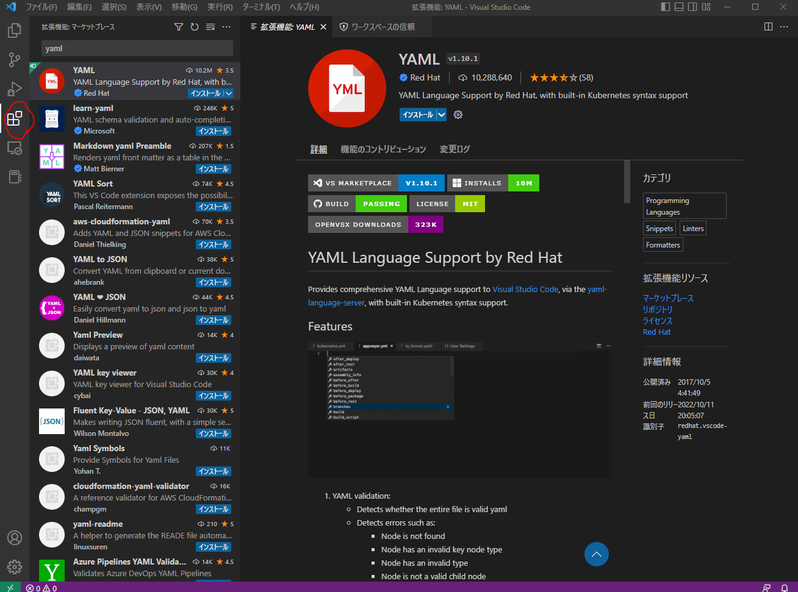
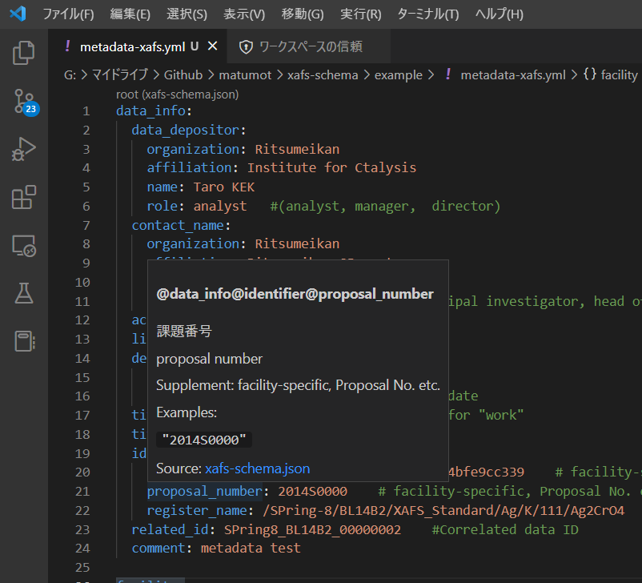
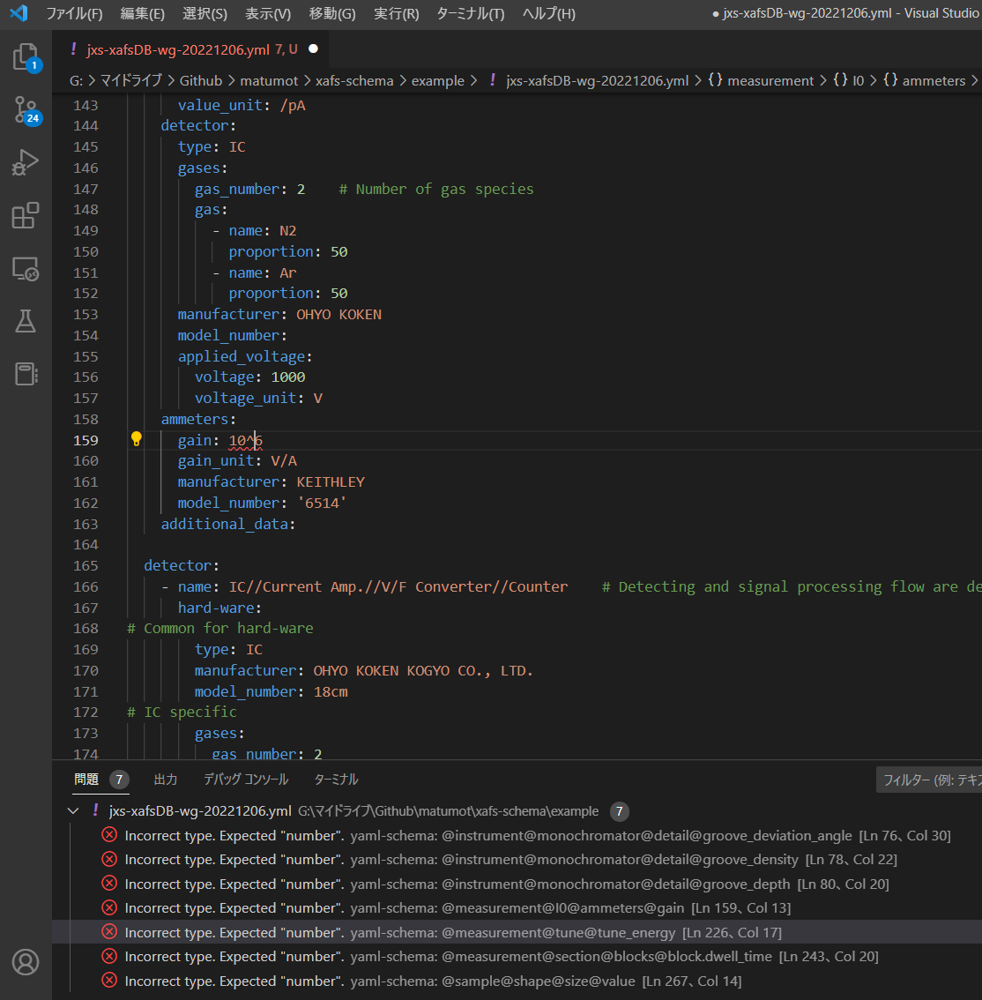

# Visual Studio Codeを用いたメタデータスキーマ確認 (YAML)


## 事前準備

### YAMLプラグインのインストール

Visual Studio Codeを起動し、左下の Extensionsをクリックし、左上の検索窓で yaml を入力し、検索します。そこで現れた YAMLプラグインをインストールします。




### settings.jsonの編集

* 左下の1で Settingsを選択します。
* 2の上部の検索窓で settings と入力します。
* その結果表示される 3 の Edit in settings.json をクリックします。


* settings.json では以下のようにyaml.schemasの設定を入力します。
  * **下記ではスキーマチェックを対象ファイルを \*xafs\*.yml としていますが、metadata\*.html など、利用状況に応じて適宜スキーマチェック対象ファイルを変更してください。**

**データ型のチェックを行わない場合**

```
{
    "yaml.schemas": {
        "https://raw.githubusercontent.com/matumot/xafs-schema/main/draft/20221212/xafs-schema.json": [
            "*xafs*.yml"
        ]
    }
}
```

**データ型のチェックを行う場合**

```
{
    "yaml.schemas": {
        "https://raw.githubusercontent.com/matumot/xafs-schema/main/draft/20221212/xafs-schema-strict.json": [
            "*xafs*.yml"
        ]
    }
}
```

上記で各スキーマファイルは以下の仕様になっています。

| スキーマファイル        | 説明                                                         |
| ----------------------- | ------------------------------------------------------------ |
| xafs-schema.json        | データ型のチェックは緩くなっています。 (数値・文字列の区別なし、空欄もOK) |
| xafs-schema-strict.json | データ型のチェックも行います。 標準試料データなど信頼度の高いデータに対してはこちらのスキーマ利用を推奨します。 |


## スキーマチェックの利用例

* メタデータ語彙の上にカーソルを移動させると説明が表示されます。




* メタデータに整合性が取れていない場合にはエラーメッセージが表示されます。
  * 下記の場合では "10^6" から "10.0e+6"に変更するとエラーは消えます。





